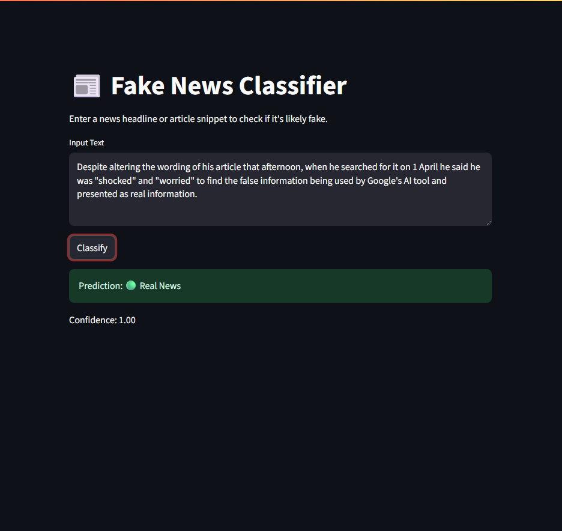
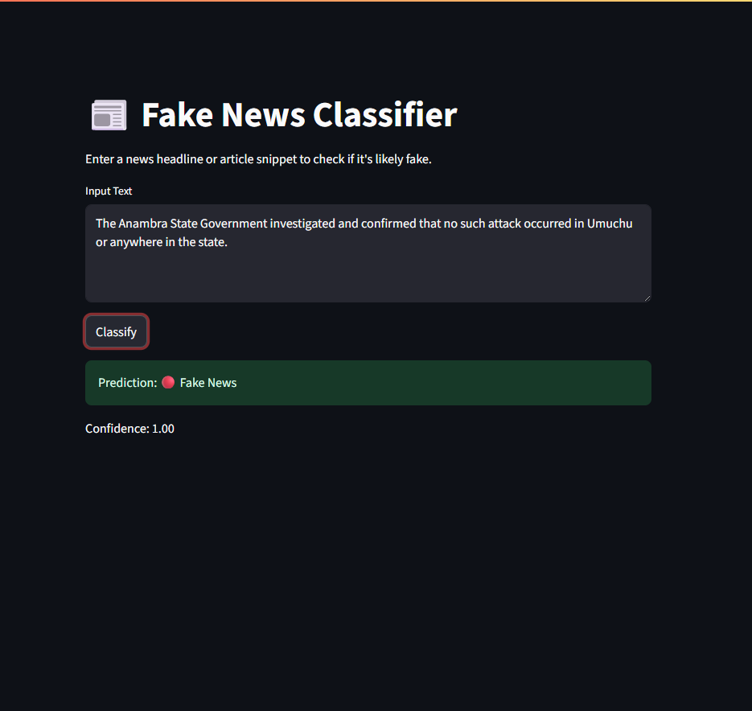

# Fake News Classifier


A modular, graph-based NLP app built with PyTorch and Streamlit to detect fake news headlines. Designed to be recruiter-ready, with clean structure, intuitive UI, and accessible code.

---

##  Demo




---

##  Features

- GNN-powered classification using heterogeneous graphs
- Streamlit UI for easy interaction
- Confidence scores and visual feedback
- Dummy graph generation for reproducibility
- Modular, extensible architecture
- Recruiter-friendly UX design

---

## Tech Stack

- [PyTorch](https://pytorch.org/)
- [PyTorch Geometric](https://pytorch-geometric.readthedocs.io/en/latest/)
- [Streamlit](https://streamlit.io/)
- Python 3.10+

---

##  Installation

```bash
git clone https://github.com/dhananjayaDev/fake-news-classification.git
cd fake-news-classification
python -m venv venv
source venv/bin/activate  # or venv\Scripts\activate on Windows
pip install -r requirements.txt
```

---

##  Run the App

```bash
streamlit run app/app.py
```

Then navigate to: [http://localhost:8501](http://localhost:8501)

---

## Model

The GNN model is trained to classify articles as real or fake based on their graph representation.

- Uses a heterogeneous Graph Neural Network (GNN)
- Trained on synthetic graphs generated from input text
- Classification done on the article node type
- Includes confidence score outputs and evaluation metrics

---

##  Sample Metrics

- Accuracy: 96.01%
- F1-Score (weighted): 0.9601
- Precision/Recall balanced for real and fake labels
- Confusion Matrix included in evaluation logs

---

##  Folder Structure


```
fake_news_gnn_app/
├── assets/
|   │   
│   |
│   └── gnn_model.pth
├── model/
|   │   
│   |__gnn_model.py
│   
├── venv/
├── app.py
├── README.md
├── requirements.txt
├── .gitignore
├── demo1.png
├── demo2.png
├── fake news banner.png
```

---

##  Sample Headlines

```text
Breaking: NASA finds water on Mars again.
```

Expected: ✅ Real

```text
Bill Gates caught using fake vaccine in secret lab!
```

Expected: ❌ Fake

---

##  UI/UX Notes

- Real-time headline input with feedback
- Confidence bar visualization
- Clear result labeling
- Ideal for recruiter/portfolio demos

---

##  Deployment Tips

- Use [Streamlit Cloud](https://streamlit.io/cloud) for one-click free hosting
- Model weights included for fast bootstrapping
- Add support for Hugging Face Spaces or Docker for scaling

---

##  Author

**Dhananjaya**  
[GitHub Profile](https://github.com/dhananjayaDev)

---

##  License

This project is licensed under the MIT License.

